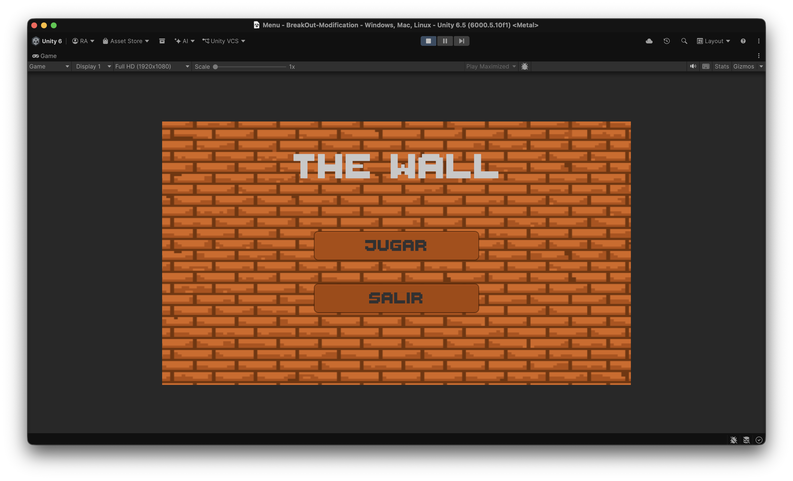
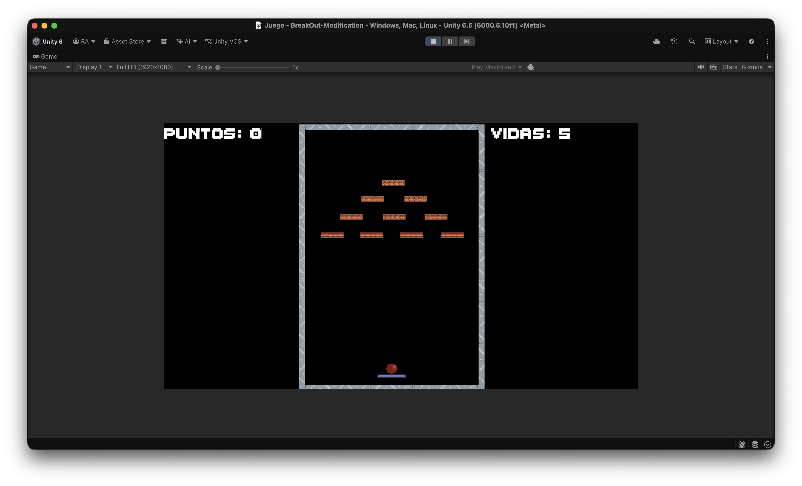
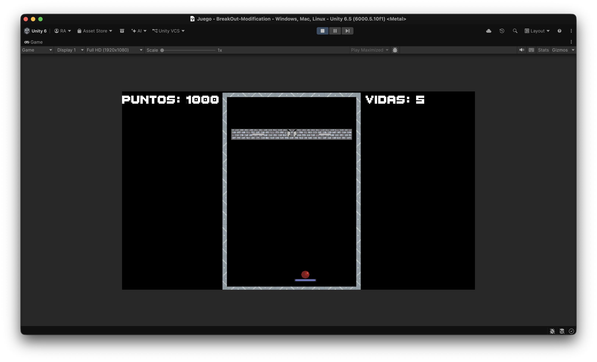
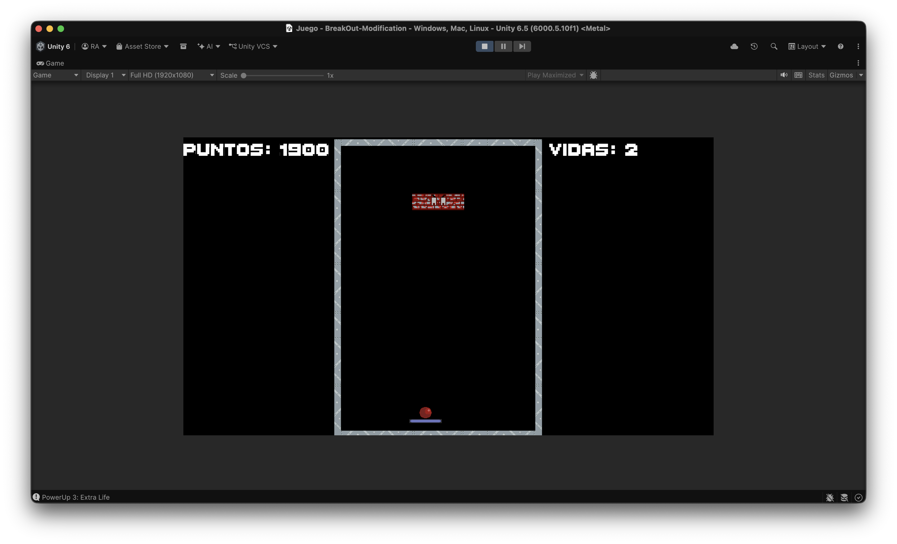

# Breakout Modification - The Wall

A 2D game built with Unity based on the classic Breakout formula. This project features standard block-breaking mechanics, a power-up system, and a two-phase boss fight that triggers once the initial level is cleared.

## Screenshots

| Main Menu | Gameplay & Power-Ups |
| :---: | :---: |
|  |  |
| **Boss Fight: Phase 1** | **Boss Fight: Phase 2** |
|  |  |

## Features

* **Core Mechanics:** Standard paddle movement and block breaking. The ball's bounce every time it hits a wall or the paddle.
* **Power-Ups:** Falling capsules drop randomly when blocks are destroyed. Effects include:
  * Multi-ball
  * Increased ball speed
  * Expanded paddle size
  * Reduced paddle speed
  * Extra life
* **Boss Encounter:** Spawns after all standard blocks are destroyed.
  * **Phase 1:** A large block that takes multiple hits. The ball increases in speed with each successful hit.
  * **Phase 2:** The boss shrinks, moves horizontally to avoid the ball, tracks the ball's position with its eyes, and periodically drops a mix of harmful projectiles and helpful capsules.

## Controls

* **A / D** or **Left / Right Arrows:** Move the paddle horizontally.
* **Spacebar:** Launch the ball from the paddle.
* **Mouse:** Navigate menus.